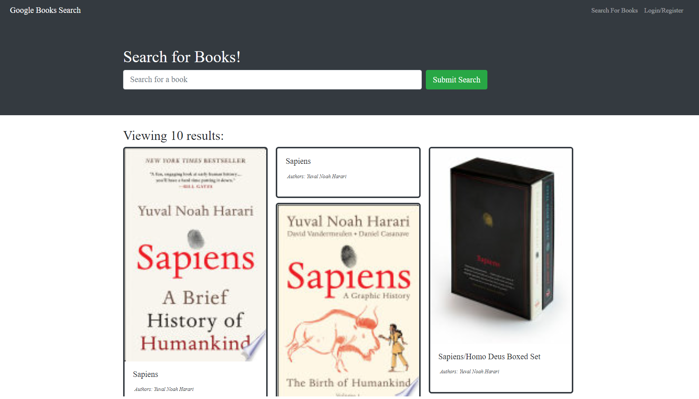

 # Book Search Engine

## [Live App]()
### [My GitHub](https://github.com/matildabrantley)
## Table of Contents:
* [Projects](#features)
* [License](#license)
* [Questions](#questions)
## Description
M.E.R.N. stack search engine for books using Google Books API and GraphQL (with Apollo Server).
## Features
* Search for any book with Google Books API and receive detailed descriptions with front cover of books matching results.
* Live app hosted on Heroku with MongoDB Atlas database.
* Register an account, login as user, passwords securely stored with hashing, bcrypt.
* Save favorite books to account.

## Screenshots

## License
The project is licensed under the MIT License license.
## Questions
Questions about the project may be directed to my email at matildahbrantley@gmail.com.
Here is a link to [my GitHub](https://github.com/matildabrantley) 
for access my other work.
